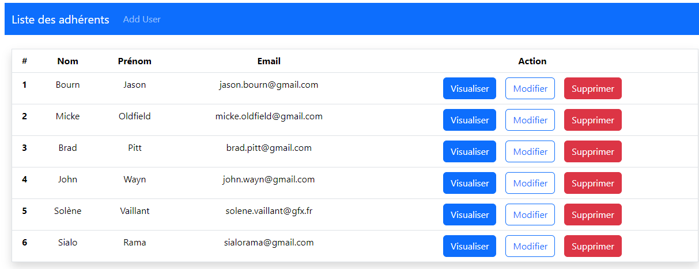

Cette application de gestion d'utilisateurs a un backend développé en Java à l'aide de Spring Boot et une interface frontend développée en React. 
Le backend fournit une API pour gérer les utilisateurs et inclut la gestion des contrôleurs, des modèles, des exceptions et des opérations de base de données.
Le frontend quand a lui permet d'ajouter, de modifier et de consulter des utilisateurs.

# Backend :

## Structure du Backend :

Le backend est structuré comme suit :

```
│   backend
│   
├───main
│   ├───java
│   │   └───fr
│   │       └───backendapp
│   │           │   BackendAppApplication.java
│   │           │   
│   │           ├───controller
│   │           ├───exception
│   │           ├───model
│   │           │       user.java
│   │           │       
│   │           └───repository
│   │                   UserRepository.java
│   └───resources
│       │   application.properties
│       ├───static
│       └───templates
└───test
    └───java
        └───fr
            └───backendapp
                    BackendAppApplicationTests.java
```

### Explication des dossiers

- `main/java/fr/backendapp` : Contient le code source de l'application.
  - `BackendAppApplication.java` : Le point d'entrée de l'application Spring Boot.
  - `controller` : Gère les requêtes HTTP entrantes.
  - `exception` : Contient les classes liées à la gestion des exceptions.
  - `model` : Définit les entités du domaine (ex. : `User.java`).
  - `repository` : Interagit avec la base de données à l'aide de Spring Data JPA.
- `resources` : Contient les fichiers de configuration et les ressources statiques.
  - `application.properties` : Fichier de configuration de l'application.
  - `static` : Contient des ressources statiques (CSS, JS, images, etc.).
  - `templates` : Contient des templates HTML si vous utilisez Thymeleaf.
- `test` : Contient les tests unitaires de l'application.
  - `BackendAppApplicationTests.java` : Tests pour l'application principale.

## Prérequis

- Java 17+
- Maven 3.6+
- Spring Boot 2.5+
- Base de données (ex. : MySQL, PostgreSQL, etc.)

## Installation

1. Clonez le projet :
```bash
   git clone https://github.com/votre-utilisateur/BackendApp.git
```
2. Accédez au répertoire du projet :
```bash
   cd BackendApp
```
3. Configurez votre base de données dans le fichier `application.properties`.

4. Compilez et lancez l'application :
```bash
   mvn clean install
   mvn spring-boot:run
```

## Usage

L'API permet la gestion des utilisateurs. Voici quelques exemples de requêtes que vous pouvez utiliser :

- **GET /users** : Récupère la liste des utilisateurs.
- **POST /users** : Crée un nouvel utilisateur.
- **PUT /users/{id}** : Met à jour les informations d'un utilisateur.
- **DELETE /users/{id}** : Supprime un utilisateur.

## Tests

Pour exécuter les tests, utilisez la commande suivante :

```bash
mvn test
```

# Frontend :

## Structure du Frontend :

```
frontend/
│   App.css         # Fichier de style principal pour l'application
│   App.jsx         # Composant racine de l'application
│   frontend.txt    # Fichier d'information pour le frontend
│   index.css       # Style global du projet
│   main.jsx        # Fichier d'entrée pour ReactDOM.render
│   
├───assets          # Dossier contenant les ressources (images, icônes, etc.)
├───layout
│       Navbar.jsx  # Composant de la barre de navigation
│       
├───pages
│       Home.jsx    # Page d'accueil de l'application
│       
└───users
        AddUser.jsx  # Page pour ajouter un utilisateur
        EditUser.jsx # Page pour modifier un utilisateur
        ViewUser.jsx # Page pour voir les détails d'un utilisateur
```

## Fonctionnalités

- **Ajout d'un utilisateur** : Le composant `AddUser.jsx` permet d'ajouter de nouveaux utilisateurs via un formulaire.
- **Modification d'un utilisateur** : Le composant `EditUser.jsx` permet de modifier les informations d'un utilisateur existant.
- **Visualisation d'un utilisateur** : Le composant `ViewUser.jsx` permet de consulter les détails d'un utilisateur.
- **Navigation** : Le composant `Navbar.jsx` gère la navigation entre les différentes pages.

## Installation et configuration

1. Cloner ce dépôt :
```bash
   git clone https://github.com/nom-utilisateur/nom-repo.git
```

2. Aller dans le dossier du projet :
```bash
   cd frontend
```

3. Installer les dépendances :
```bash
   npm install
```

4. Démarrer le projet en mode développement :
```bash
   npm start
```

## Technologies utilisées

- **React** : Bibliothèque JavaScript pour la création d'interfaces utilisateur.
- **CSS** : Pour le style des composants.
  
## Contributions

Les contributions sont les bienvenues ! Si vous souhaitez contribuer, veuillez suivre ces étapes :

1. Fork ce dépôt
2. Créer une nouvelle branche (`git checkout -b fonctionnalité/amélioration`)
3. Commit vos modifications (`git commit -m 'Ajout d'une nouvelle fonctionnalité'`)
4. Push vers la branche (`git push origin fonctionnalité/amélioration`)
5. Créer une Pull Request

## Apperçu du résultat


## Licence

Ce projet est sous licence MIT.

